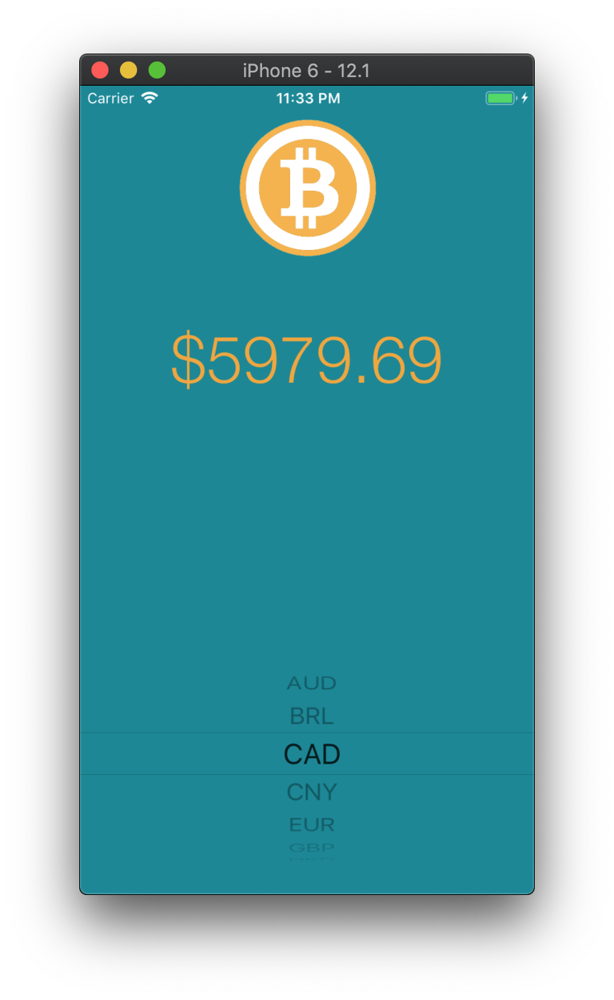

#  Bitcoin Ticker

#### What is Bitcoin Ticker?

>This is a Bitcoin price ticker. The app will give you the latest Bitcoin prices in all the popular, traded currencies, so you can track how well your Bitcoin investments are doing on the go.

#### Cocoapods used

1. Alamofire
2. SwiftyJSON

#### Bitcoin data used from

[BitcoinAverage API](https://apiv2.bitcoinaverage.com)

#### Here is a screenshot of the working app

>This is a companion project to The App Brewery's Complete App Developement Bootcamp, check out the full course at [www.appbrewery.co](https://www.appbrewery.co/)